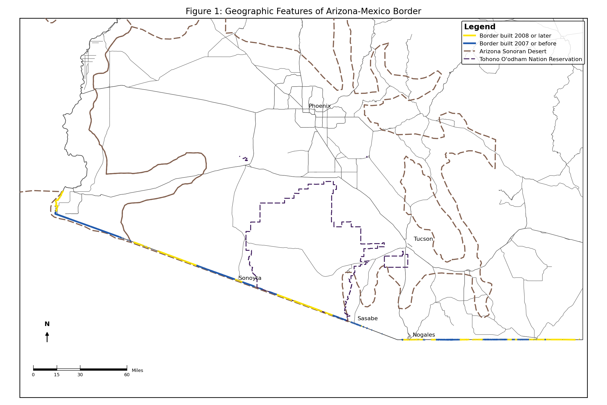
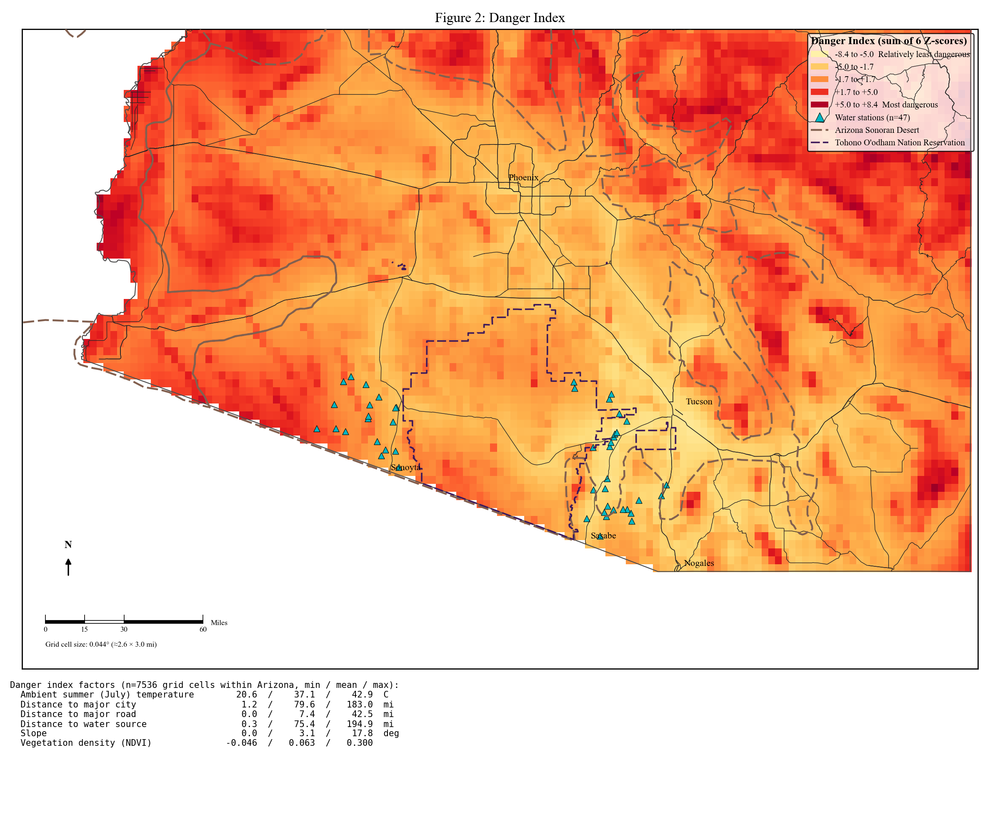
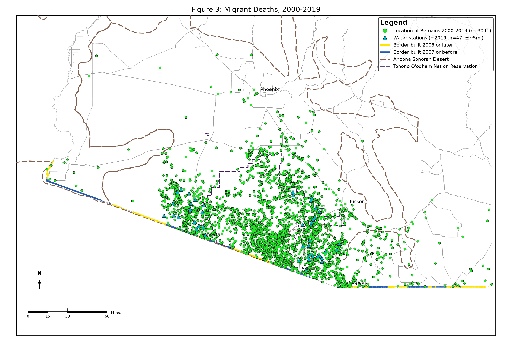
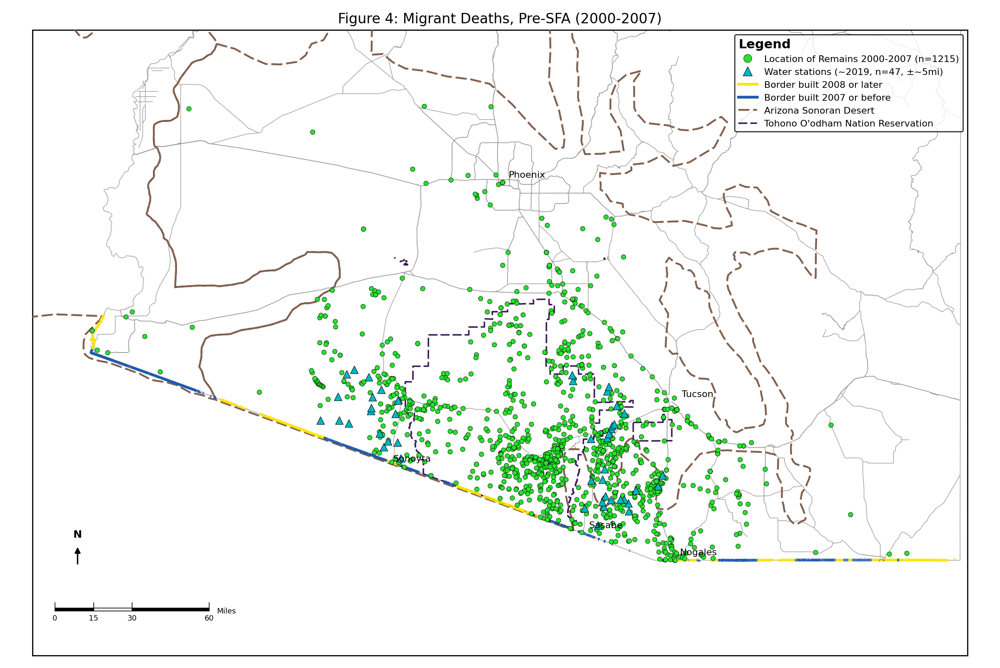
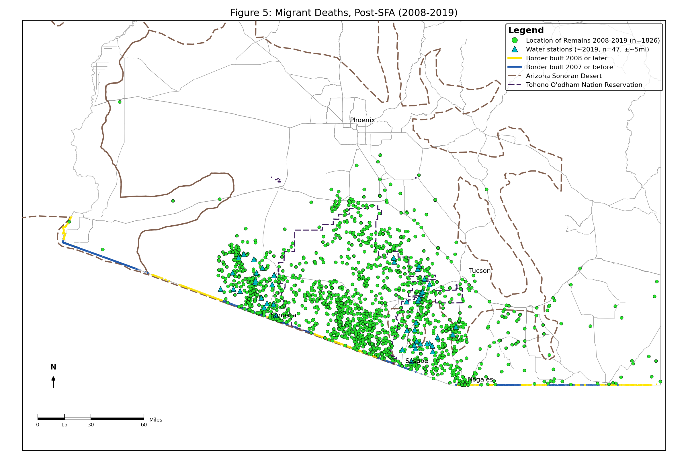
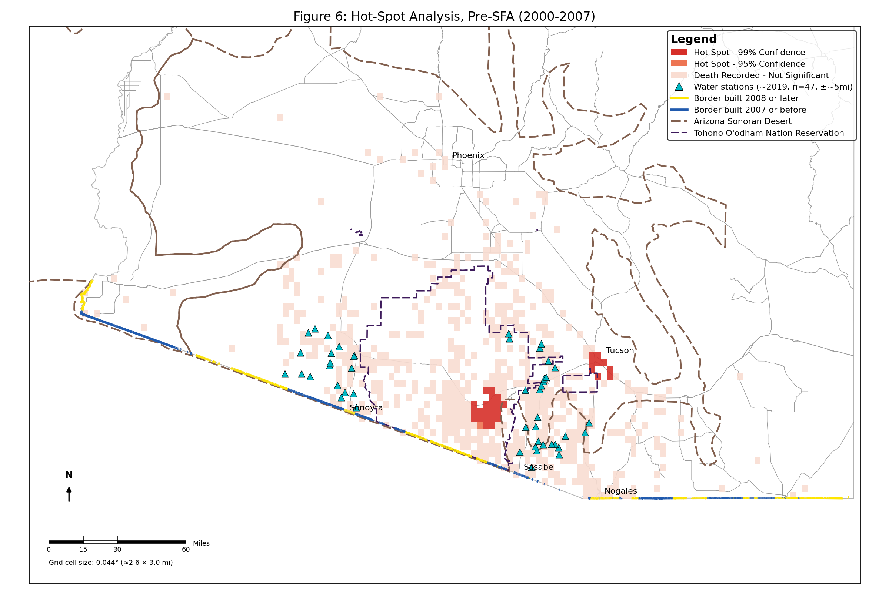
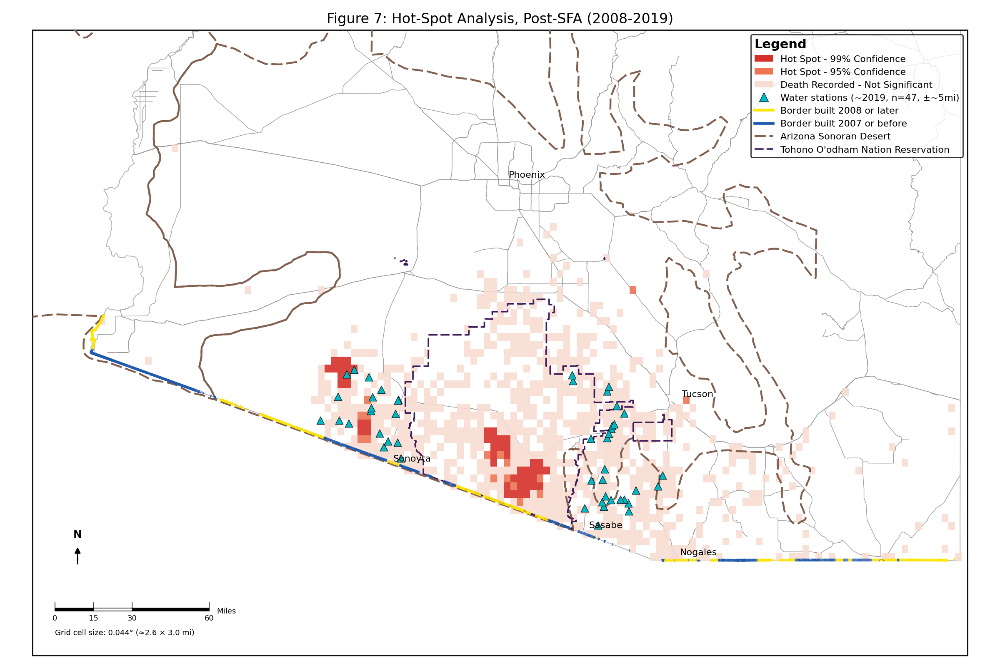
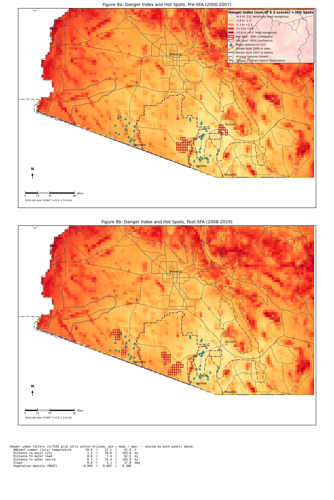
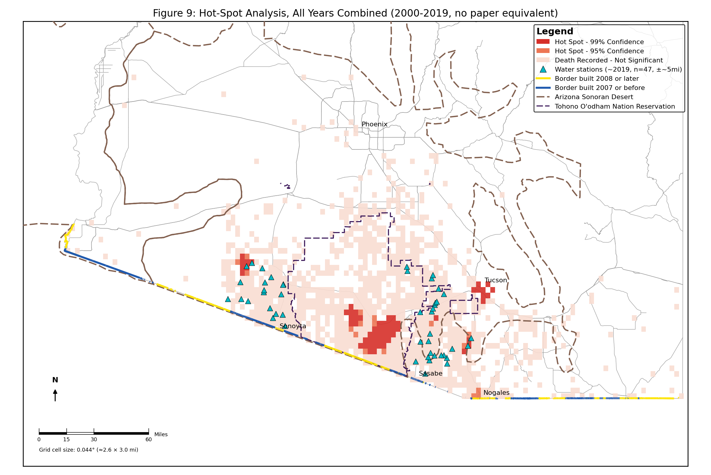
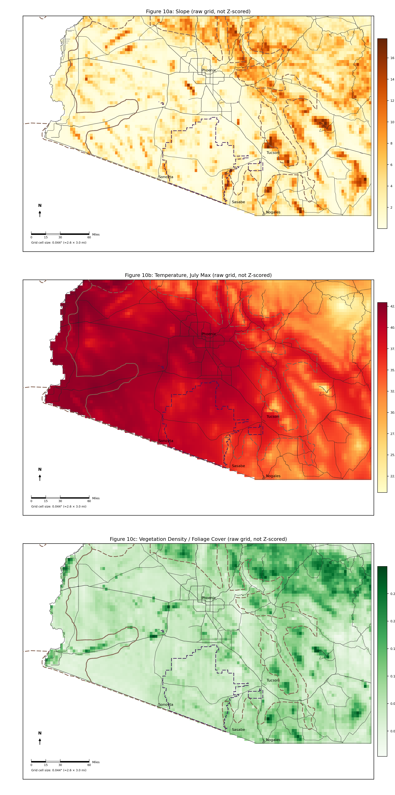

# Reproducing Figures 1–8

This repo reproduces Figures 1–8 from Bansak, Blanco, Coon & Dieringer (2025),
*"Border Walls and Death on the US-Mexico Border,"* plus two supplementary
figures with no direct equivalent in the paper: Figure 9 (a hot-spot analysis
of all years combined) and Figure 10 (the raw slope/vegetation-density grids
that feed the danger index, shown descriptively rather than Z-scored).
Everything here is built from the paper's own underlying data — nothing about
*which* deaths are pre-/post-SFA, or where the fence/desert/reservation
boundaries are, was eyeballed from the published images. This document is the
map: what each script does, in what order, using what data, and how to check
that it did it correctly.

**New here?** See `GETTING_STARTED.html` for a plain-language, no-coding-
background-needed walkthrough. This README is the technical reference.

**Reviewing this without cloning the repo?** Every figure below is a live
image already committed to `figures/` — GitHub renders them inline on this
page, so scrolling down is enough; no need to clone, install anything, or
run any script. These are the Python outputs; the R versions (`_R.png` in
the same folder) are numerically validated to match — see §6.

## Figure previews

**Figure 1 — Geographic reference map** (Arizona boundary, roads, Sonoran Desert, Tohono O'odham Nation Reservation, fencing by period)


**Figure 2 — Danger index** (rebuilt: 6 Z-scored factors, see `docs/DANGER_INDEX_METHODOLOGY.md`)


**Figure 3 — All migrant deaths, 2000–2019** (n = 3,041)


**Figure 4 — Pre-SFA deaths, 2000–2007** (n = 1,215)


**Figure 5 — Post-SFA deaths, 2008–2019** (n = 1,826)


**Figure 6 — Hot-spot analysis, pre-SFA**


**Figure 7 — Hot-spot analysis, post-SFA**


**Figure 8 — Danger index with hot spots overlaid, both periods**


**Figure 9 — Hot-spot analysis, all years combined** (no direct paper equivalent)


**Figure 10 — Raw slope and vegetation-density grids** (descriptive, not Z-scored — shows how two of the danger index's six inputs are actually distributed; Python-only so far, no R port yet)


## 0. Repo layout

```
python/   every Python script (shared libraries + one entry script per figure)
r/        the same, in R -- kept functionally identical, see §6
data/     all input data (death records, water stations, shapefiles, the
          fence geodatabase, danger-index environmental layers)
figures/  every script's PNG output lands here, regardless of language
docs/     methodology write-ups, references, and session-handoff notes
```

Both languages find their own files via the running script's own location
(not the working directory you launch from), so any command below works
whether you run it from the repo root or from inside `python/`/`r/`.

## 1. What's in this repo

**The paper's own source data** (as originally provided, unmodified):
| File/folder | What it is |
|---|---|
| `data/Original death data.csv` | Arizona OpenGIS Initiative for Deceased Migrants (PCMOE / Humane Borders) — the raw point data everything else is built from |
| `data/Original Fence data/01-ORIGINAL.gdb` | CBP tactical-infrastructure geodatabase (pedestrian fence + vehicle barriers, by install date). Its internal metadata marks it **FOUO** (For Official Use Only) — a DHS sensitivity marking, worth knowing about if this repo is shared further |

**`docs/REFERENCES.md`** lists every external data source used to build these
figures — full URLs, access dates, and citations — in one place.

**Basemap geography** (public data, downloaded fresh — not originally part of
the paper's data; see `data/Shape Files/` and the top of `basemap_common.py`
for exact sources: Census TIGER/Line 2021 for roads/state/tribal lands, USGS
2006 for the Sonoran Desert boundary):
| Folder | Contents |
|---|---|
| `data/Shape Files/tl_2021_us_state` | Arizona state boundary |
| `data/Shape Files/tl_2021_04_prisecroads` | Arizona interstate/US/state highways |
| `data/Shape Files/tl_2021_us_aiannh` | Tohono O'odham Nation Reservation boundary |
| `data/Shape Files/deserts_sw` | Sonoran Desert boundary (Faunt, 2006 — the exact survey the paper cites) |

**The reproduction code** (what this README is mainly about — all in `python/`):
| File | Role |
|---|---|
| `basemap_common.py` | Shared library — not run directly. Loads/classifies the death data, loads fence layers, and draws the shared basemap (state boundary, roads, desert, reservation, legend, scale bar, north arrow) that every figure below uses. |
| `hotspot_common.py` | Shared library — not run directly. Implements the Getis-Ord Gi\* hot-spot statistic from scratch and renders hot-spot maps on the same basemap. |
| `figure3.py` | **Run this.** All migrant deaths, 2000–2019 (Figure 3). |
| `figure4.py` | **Run this.** Pre-SFA deaths, 2000–2007 (Figure 4). |
| `figure5.py` | **Run this.** Post-SFA deaths, 2008–2019 (Figure 5). |
| `figure6.py` | **Run this.** Hot-spot analysis, pre-SFA (Figure 6). |
| `figure7.py` | **Run this.** Hot-spot analysis, post-SFA (Figure 7). |
| `figure9_hotspot.py` | **Run this.** Hot-spot analysis, all years combined (Figure 9 — no paper figure number, extends the same method to the full dataset). |
| `danger_index_common.py` | Shared library — not run directly. Rebuilds the paper's Figure 2 danger index with a different factor set (temperature, distance to city/road/water, slope, vegetation density) and Z-score-based scoring, on the same grid as the hot-spot analysis. |
| `figure2.py` | **Run this.** The rebuilt danger index (Figure 2). |
| `figure8.py` | **Run this.** Danger index overlaid with hot spots (Figure 8) — both pre- and post-SFA, as two stacked panels sharing one legend. Reuses the exact same colors as `figure2.py`/`figure6.py`/`figure7.py` (danger palette, `HOT_99`/`HOT_95`), just as unfilled outlines so the danger-index color shows through each cell. |
| `basemap_white_common.py` | Shared library — not run directly. The plain reference-layer basemap (state boundary, roads, desert, reservation, fencing) with no death/danger data on it. |
| `figure1.py` | **Run this.** The paper's geographic reference map (Figure 1) — the one figure in the original paper this reproduction hadn't rebuilt until now. |
| `raw_factor_common.py` | Shared library — not run directly. Renders the raw `slope_deg`/`ndvi` grids from `data/Danger Index Environmental Layers.csv` as true rasters (`imshow`, real colorbars) — descriptive, not run through the danger index's Z-scoring. Python-only so far. |
| `figure10_raw_factors.py` | **Run this.** Two-panel raw slope + vegetation-density raster (Figure 10, no paper equivalent). |
| `fetch_ndvi_layer.py` | One-off/re-runnable data-acquisition script that (re)populates the `ndvi` column of `data/Danger Index Environmental Layers.csv` from USGS NAIP imagery. Not part of the normal figure-rendering pipeline, and **Python-only, deliberately** — no R equivalent exists. **R-only users:** this doesn't affect you for running any figure — the `ndvi` column ships already populated in the committed CSV, and `danger_index_common.R` just reads it as a plain column like `slope_deg`. This script only matters if you want to *refresh* the NDVI data itself (e.g. against newer imagery), which currently requires Python. |
| `summarize_danger_factors.py` | Reporting utility — not part of the figure pipeline. Regenerates the two factor-summary tables (data sources/direction, descriptive statistics) in `docs/DANGER_INDEX_METHODOLOGY.md` §2, and writes `docs/danger_index_factor_summary.csv`. Re-run this whenever the underlying environmental data changes so the doc's tables don't drift out of sync. |

**Root-level files:**
| File | Role |
|---|---|
| `requirements.txt` | Exact package list needed to run any Python script above |
| `docs/Claude Hotspot documentation.md` | **The full statistical write-up** for the Gi\* method — read this before trusting the hot-spot figures' output. This README gives the pipeline overview; that document gives the formulas, parameter choices, and validation detail. |
| `docs/DANGER_INDEX_METHODOLOGY.md` | **The full write-up** for the rebuilt danger index — what changed from the original, data sources for each factor, a real bug that had to be fixed in the slope calculation, and known limitations. Read before citing `figure2.py`'s output. |
| `data/Water Stations 2000-2019.csv` | Humane Borders water station locations, shown on every figure as teal triangles. **Not** part of the paper's original data — extracted from Humane Borders' own public poster. See `docs/WATER_STATIONS_METHODOLOGY.md` for the extraction method, a dropped/less-reliable earlier extraction, and this dataset's ~5 mile positional uncertainty before relying on it for anything beyond a visual reference. |
| `docs/WATER_STATIONS_METHODOLOGY.md` | Source, extraction method, and quantified uncertainty for the water station coordinates above. |
| `data/Danger Index Environmental Layers.csv` | Per-grid-cell slope, July temperature, and NDVI (vegetation density) data backing the danger index, at the same resolution as the hot-spot grid. See `docs/DANGER_INDEX_METHODOLOGY.md` for sources. |
| `docs/danger_index_factor_summary.csv` | Machine-readable version of the descriptive-statistics table in `docs/DANGER_INDEX_METHODOLOGY.md` §2 (min/mean/max/std dev per factor) — generated by `summarize_danger_factors.py`, useful for pasting directly into the manuscript. |
| `docs/danger_index_factor_tables.docx` | The same two tables, formatted as publication-style three-line (booktabs) academic tables in Times New Roman — ready to copy directly into the manuscript. Same numbers as the CSV/methodology doc above; this is presentation, not a new analysis. |
| `summarize_hotspot_raster.py` | Reporting utility — not part of the figure pipeline. Computes the Gi\* hot-spot summary (by period) and the shared raster grid specification, printed as Markdown and written to `docs/hotspot_raster_summary.csv`. Re-run whenever the death data or grid parameters change. |
| `docs/hotspot_raster_summary.csv` | Machine-readable version of the two tables above. |
| `docs/hotspot_raster_tables.docx` | The same two tables as publication-style three-line academic tables (landscape orientation — Table 1 has 9 columns), ready to paste into the manuscript. |
| `summarize_death_demographics.py` | Reporting utility — not part of the figure pipeline. Recreates the paper's Table 4 ("Sample of Summary Statistics" — gender, age group, cause of death by Total/pre-SFA/post-SFA), computed directly from `data/Original death data.csv`. Writes `docs/table4_summary_statistics.csv`. Re-run whenever the death-records CSV changes. |
| `docs/table4_summary_statistics.csv` | Machine-readable version of Table 4 above. |
| `docs/table4_summary_statistics.docx` | Table 4 as a publication-style three-line academic table, ready to paste into the manuscript. Content matches the original Table 4 (independently re-verified from source data), reformatted only. |

**R versions**: every script above also has an `.R` equivalent in `r/`
(`basemap_common.R`, `hotspot_common.R`, `danger_index_common.R`,
`figure2.R`, `figure3.R` ... `figure9_hotspot.R`) that produces closely
matching results using R instead of Python — see §6.

## 2. One-time setup

You need a Python virtual environment (`.venv`) with the packages in
`requirements.txt` installed. This is **machine-specific** — if you're
setting up on a new computer (including sharing this project with a
coauthor), don't try to reuse someone else's `.venv` folder; build your own:

```bash
python3 -m venv .venv
./.venv/bin/pip install -r requirements.txt
```

Use a Python version between 3.9 and 3.12 — `geopandas`/`pyproj` (needed for
the fence-line overlay) don't yet have prebuilt installers for very new
Python versions (3.13+).

Every `figureN.py` script automatically re-launches itself under `.venv` if
it wasn't started with it already, so as long as `.venv` exists at the repo
root, you don't need to manually select an interpreter to get correct
results from the command line. (IDEs like PyCharm/VS Code still need to be
*pointed at* `.venv` for their own UI features — see below — but the scripts
self-correct regardless.)

**To run any figure:** open it in VS Code/PyCharm and hit Run, or from a
terminal at the repo root:
```bash
./.venv/bin/python python/figure4.py
```
Each script prints its record count and saves a PNG named after itself
(e.g., `figure4_reproduction.png`) into `figures/`.

## 3. The point-map figures (3, 4, 5): pipeline

All three share one pipeline, in `basemap_common.load_deaths()` and
`render_figure()`:

1. **Load** `data/Original death data.csv`.
2. **Classify each record** as pre-SFA or post-SFA using the exact rule
   described in the paper's Section 4.2: pre-SFA = discovered 2000–2007, OR
   discovered in 2008 with a postmortem interval of "> 6-8 months" (i.e., the
   death likely occurred in 2007, even though the remains were found in
   2008). Post-SFA = discovered 2008–2019, excluding blank-postmortem
   records and the reclassified 2008 cases above.
3. **Filter** to the subset that figure needs (all / pre / post).
4. **Draw the basemap**: Arizona state boundary, major roads, Sonoran Desert
   boundary, Tohono O'odham Reservation boundary, border fencing (colored by
   pre-2008 vs. 2008-or-later install date, read from the CBP geodatabase).
5. **Plot the death points and water stations** (teal triangles — not part
   of the original figures; see `docs/WATER_STATIONS_METHODOLOGY.md`), add city
   labels, scale bar, north arrow, and a legend styled to match the
   original figures' colors (sampled directly from the embedded images in
   the paper's `.docx`).

**How to validate this part:** each script prints its record count on run.
These are checked against the paper's own Table 4 and will print a warning
if they don't match:
- Figure 3 (all): **n = 3,041**
- Figure 4 (pre-SFA): **n = 1,215**
- Figure 5 (post-SFA): **n = 1,826**

If your copy of `data/Original death data.csv` has been updated with newer
records since the paper's data pull, these totals will drift upward — that's
expected and the scripts will tell you.

## 4. The hot-spot figures (6, 7, and the all-years extra): pipeline

This is the more involved analysis. Full statistical detail, formulas, and
— importantly — an honest account of where this could and couldn't be
validated against the paper's own ArcGIS output, is in
**`docs/Claude Hotspot documentation.md`**. Here is the pipeline at a glance:

1. **Start from the same classified death points** as §3 (pre-SFA / post-SFA
   / all, depending on the script).
2. **Aggregate into a grid**: lay a grid of ~0.044°-square cells (~2.7 miles
   per side) over the study area and count deaths per cell. Empty cells are
   discarded — only cells with at least one death are analyzed further (this
   matches how the paper's own `.dbf` output is structured: far fewer
   populated cells than a full grid would produce).
3. **Define spatial weights**: for each populated cell, determine which
   other cells count as its "neighbors" for the statistic. This uses a fixed
   distance band, sized so each cell has ~8 neighbors on average (a standard,
   documented default) — chosen because I could **not** reverse-engineer
   ArcGIS's actual internal parameter (see the write-up for the validation
   attempt and why).
4. **Compute the Getis-Ord Gi\* statistic** for every populated cell: a
   Z-score comparing that cell-plus-its-neighbors' death count against what
   you'd expect if deaths were randomly distributed across the whole study
   area, converted to a two-tailed p-value.
5. **Correct for multiple testing**: with 600–1,000+ cells tested
   simultaneously, some will look "significant" by chance alone. A
   Benjamini-Hochberg False Discovery Rate (FDR) correction is applied at the
   90/95/99% confidence levels (matching ArcGIS's *Optimized* Hot Spot
   Analysis tool, which does this by default).
6. **Classify** each cell into a `Gi_Bin`: +3/+2/+1 for hot spots
   (99%/95%/90% confidence), −3/−2/−1 for cold spots, 0 for not significant.
7. **Draw**: the 95% and 99% hot-spot tiers are filled with the same dark
   red / salmon sampled from the original figures. Every *other* populated
   cell (a death was recorded there, just not significant) is filled with a
   pale tint of the same color family, rather than left blank — this
   reproduction intentionally shows the full extent of recorded deaths, not
   only the statistically significant clusters the original figures display.
   Water stations (teal triangles) are drawn on top, same as the point-map
   figures — see `docs/WATER_STATIONS_METHODOLOGY.md`.

**How to validate this part:** each script prints, on run:
- how many grid cells were analyzed,
- the calibrated distance band and resulting average neighbor count,
- the full `Gi_Bin` distribution (how many cells landed in each
  confidence tier).

These were validated during development against the paper authors' own
precomputed ArcGIS output (`HotBeforejuly2023.dbf` / `HotAfterJuly2023.dbf`,
containing the *exact* original `Gi_Bin`/`GiZScore`/`GiPValue`/`NNeighbors`
values ArcGIS produced) — not included in this repo, since it's the authors'
own output rather than something built here, but referenced in
`docs/Claude Hotspot documentation.md` §4 for anyone with access to it who
wants to re-check. **These will not match exactly** — see that document for
which parameters matched closely (grid cell size) and which fundamentally
couldn't be recovered (the neighbor/distance-band structure — the original's
average neighbor count is ~100–140 per cell, far larger than any standard
method reproduces without over-smoothing the result to near-nothing). This
reproduction is a legitimate, independent Gi\* analysis of the same data with
the same general method, not a pixel-exact replay of the original ArcGIS
run — the qualitative pattern (clusters shift and grow post-SFA) is what
should hold up, not exact cell-for-cell counts.

## 5. Quick reference: expected outputs

All output files land in `figures/`, regardless of which script produced them.

| Script (in `python/`) | Output file (in `figures/`) | What to check |
|---|---|---|
| `figure1.py` | `figure1_reproduction.png` | Geographic reference only — no data-driven output to check |
| `figure2.py` | `figure2_reproduction.png` | Composite index range; see `docs/DANGER_INDEX_METHODOLOGY.md` |
| `figure3.py` | `figure3_reproduction.png` | n = 3,041 |
| `figure4.py` | `figure4_reproduction.png` | n = 1,215 |
| `figure5.py` | `figure5_reproduction.png` | n = 1,826 |
| `figure6.py` | `figure6_reproduction.png` | `Gi_Bin` distribution printed to console; compare pattern (not exact counts) to the authors' own ArcGIS output (see §4) |
| `figure7.py` | `figure7_reproduction.png` | `Gi_Bin` distribution printed to console; compare pattern the same way |
| `figure8.py` | `figure8_reproduction.png` | Two panels; `Gi_Bin` distributions printed to console should match `figure6.py`/`figure7.py` exactly (604 / 814 grid cells) |
| `figure9_hotspot.py` | `figure9_hotspot_allyears.png` | No paper equivalent to compare against; sanity-check only |
| `figure10_raw_factors.py` | `figure10_raw_factors.png` | Two panels; check against `slope_deg`/`ndvi` summary stats in `docs/danger_index_factor_summary.csv` |

Every script also prints a `generated YYYY-MM-DD HH:MM:SS` line to the
console on each run — the figures themselves are now clean, production-
style output with no on-image timestamp or "(reproduction)" tag, now that
the pipeline has stabilized past the heavy-iteration stage where that
watermark was useful for telling a fresh render apart from a stale cached
one in an editor tab.

## 6. R versions

Every script above has an R port in `r/`, kept functionally identical on
purpose — same classification rule, same grid/distance-band calibration,
same Gi\* formula, same FDR correction, same colors:

| Python (`python/`) | R equivalent (`r/`) |
|---|---|
| `basemap_common.py` | `basemap_common.R` |
| `hotspot_common.py` | `hotspot_common.R` |
| `danger_index_common.py` | `danger_index_common.R` |
| `figure3.py` ... `figure9_hotspot.py` | `figure3.R` ... `figure9_hotspot.R` |
| `figure8.py` | `figure8.R` |

**Setup:** one package -- `sf` (handles the shapefiles and the fence
geodatabase, and, unlike the Python side, doesn't need a special virtual
environment to get a working GDAL install):
```r
install.packages("sf")
```

**To run:** `Rscript r/figure4.R` from a terminal at the repo root, or open
the file in RStudio/PyCharm's R plugin and Source it. Each `.R` script locates its own
folder automatically (same idea as the Python `.venv` re-exec trick, just
via `commandArgs()`/RStudio's active-document path instead), so your
working directory doesn't matter. Output PNGs get an `_R` suffix
(`figure4_reproduction_R.png`) so they don't overwrite the Python versions.

**Validated for exact parity, not just "looks similar":** the point-map
scripts (`figure3.R`/`figure4.R`/`figure5.R`) produce the identical record
counts as their Python counterparts (3,041 / 1,215 / 1,826). The hot-spot
scripts (`figure6.R`/`figure7.R`/`figure9_hotspot.R`) produce the *exact
same* grid cell counts, calibrated distance bands, and full `Gi_Bin`
distributions as `figure6.py`/`figure7.py`/`figure9_hotspot.py` — e.g. both
`figure6.py` and `figure6.R` independently compute 604 grid cells, a
0.0984° distance band, and a `Gi_Bin` split of `{0: 573, 2: 1, 3: 30}`. The
same caveats about matching (or not matching) the original paper's ArcGIS
output in `docs/Claude Hotspot documentation.md` apply equally to both language
versions, since the underlying method is identical.

The danger index (`figure2.py`/`figure2.R`) matches almost exactly between
languages — both currently report a composite index range of -5.32 to
9.61. See `docs/DANGER_INDEX_METHODOLOGY.md` §8 for the tiny remaining
floating-point-level difference and a units bug in R's road-distance
calculation that was caught and fixed along the way.

One implementation difference worth knowing about, even though it doesn't
change the results: the R version reprojects the desert shapefile with
`sf::st_transform()`, which reads the file's actual coordinate system and
converts it properly. The Python version doesn't have easy access to a
projection library in this environment, so it manually re-implements the
one relevant UTM-to-latitude/longitude conversion by hand instead (see the
`utm11n_to_lonlat()` comment in `basemap_common.py`). Both land on the same
coordinates; the R route just uses a general-purpose tool where Python had
to special-case it.
